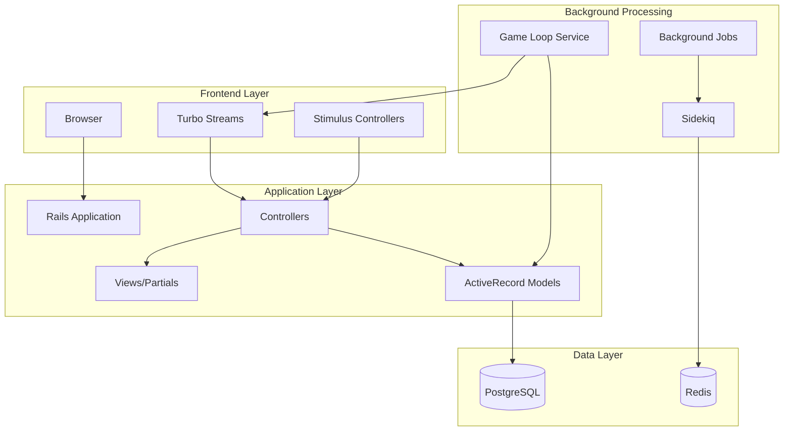

# Architecture Overview

This section documents the high-level architecture of the Villager Rails application.

## System Architecture

## Core Components

### Real-Time Game Engine
- **Game Loop**: Continuous background processing for resource generation
- **Turbo Streams**: Real-time UI updates without page refresh
- **WebSocket Connection**: Maintains live connection for instant updates

### Village Simulation
- **Villages**: Player-owned settlements with buildings and resources
- **Buildings**: Structures that produce resources over time
- **Resources**: Game currency and materials (wood, stone, food, etc.)

### Background Processing
- **Sidekiq Jobs**: Handle resource production and game state updates
- **Recurring Jobs**: Automatic game loop execution
- **Service Objects**: Encapsulate business logic for game mechanics

## Data Flow

1. **User Action** → Controller receives action
2. **Business Logic** → Service objects process game rules
3. **Database Update** → Models persist state changes
4. **Background Job** → Sidekiq schedules resource production
5. **Real-Time Update** → Turbo Stream broadcasts changes
6. **UI Refresh** → Browser receives and applies updates

## Key Design Decisions

### Asset Pipeline Strategy
- **Hybrid Approach**: Propshaft + Sprockets compatibility
- **Challenge**: Propshaft 1.2.0 compatibility issues
- **Solution**: Pinned to 1.1.0 with migration plan

### Real-Time Architecture
- **Choice**: Turbo Streams over WebSocket frameworks
- **Benefit**: Rails-native solution with minimal complexity
- **Trade-off**: Less flexible than pure WebSocket approaches

### Background Processing
- **Choice**: Sidekiq for job processing
- **Benefit**: Reliable, Redis-backed job queue
- **Use Case**: Game loop execution and resource generation

## Performance Considerations

- **Database Indexing**: Optimized queries for village/building relationships
- **Caching Strategy**: Redis for session data and job queues
- **Asset Optimization**: Efficient CSS/JS bundling and compression
- **Background Jobs**: Non-blocking resource generation

## Security Architecture

- **Authentication**: Devise for user management
- **Authorization**: Controller-level access controls
- **CSRF Protection**: Rails built-in token validation
- **Input Validation**: Strong parameters and model validations

## Deployment Architecture

- **Containerization**: Docker for consistent environments
- **Orchestration**: Kamal for deployment automation
- **Asset Serving**: Propshaft for asset compilation
- **Background Workers**: Separate Sidekiq processes

## Related Documentation

- [Design Patterns](../design-patterns/README.md)
- [Real-Time Updates](real-time-updates.md)
- [Background Processing](background-processing.md)
- [Asset Pipeline](asset-pipeline.md)
